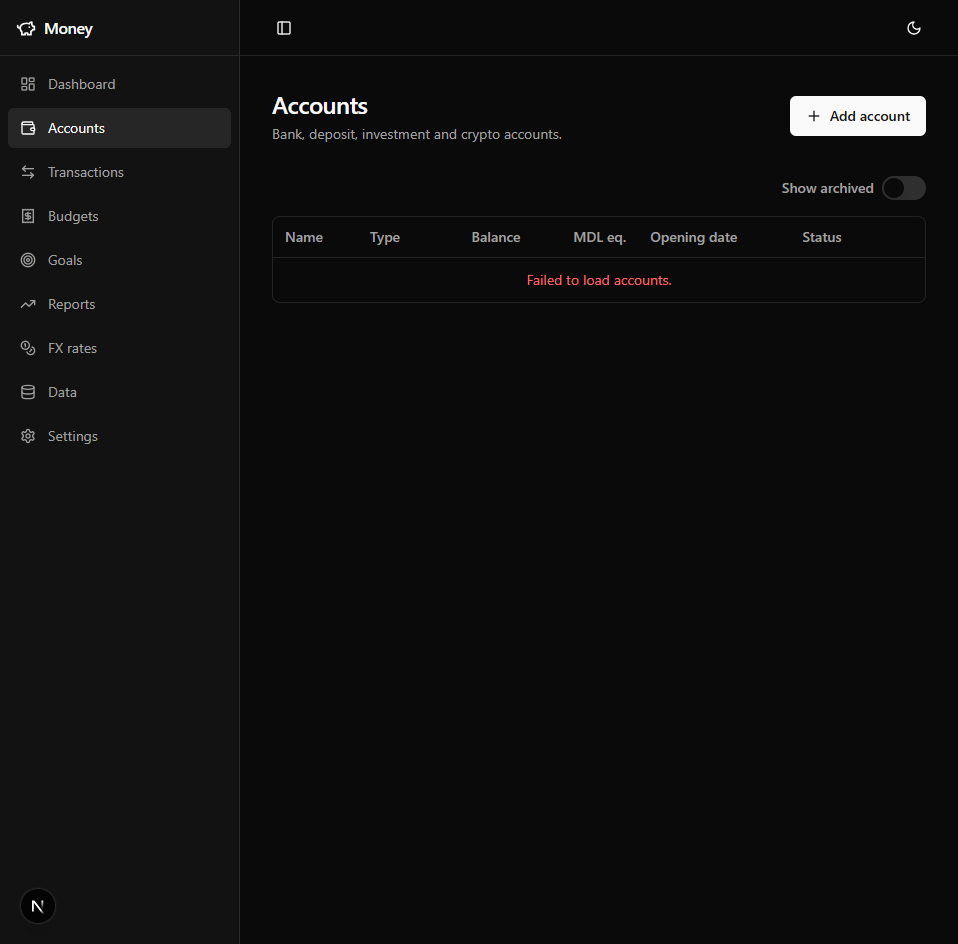

<div align="center">

# 💰 Money Management

**A self-hosted, privacy-first personal finance manager.**

Track multi-currency accounts, import real bank statements, budget, set savings goals, and watch your net worth — all on your own machine, with nothing shared to a third party.

[](https://github.com/CosteaB1/money-management/actions/workflows/ci.yml)
[](LICENSE)
&nbsp;


</div>

> [!WARNING]
> **Self-hosted, single-user, no authentication by design.** Built to run on a trusted personal machine or network — there's no login layer. Don't expose it directly to the public internet.

---

## Why

|  |  |
|---|---|
| 🔒 **Your data stays yours** | Fully self-hosted on your own PostgreSQL — no cloud account, no telemetry, no bank-API middleman. |
| 🌍 **Genuinely multi-currency** | Every account holds its own ISO currency; everything rolls up to a single reporting currency (MDL) for net worth. |
| 📄 **Real statements, not manual entry** | Import maib PDF statements — the app parses rows, splits bank fees, suggests categories & transfers, and flags duplicates before you commit. |
| 💱 **Hands-off FX** | Daily exchange rates fetched automatically from the Banca Națională a Moldovei, with manual overrides. |
| ✅ **Built to last** | Clean Architecture .NET backend with ~950 automated tests (unit + integration) and CI on every push. |

## Screenshots

<div align="center">

<!-- Replace these with richer captures (dashboard, transactions, import preview). -->



</div>

> 📸 More screenshots (dashboard, statement import, budgets) coming — the empty state above is a placeholder.

## Features

- **Multi-currency accounts** — seven types (Cash, CreditCard, BankCurrent, BankDeposit, Brokerage, CryptoExchange, P2PLending), each in its own currency.
- **Transactions & transfers** — income/expense, internal transfers (excluded from income/expense totals), and balance adjustments for investment-style accounts.
- **Categories & auto-categorization** — hierarchical categories with DB-backed keyword rules applied on import.
- **Budgets** — per-category monthly limits with on-track / warning / over status.
- **Savings goals** — manual or account-linked, with pace stats and contribution history.
- **FX rates** — automatic daily fetch/backfill from BNM plus manual rates; MDL-equivalent net-worth aggregation.
- **PDF statement import** — parse maib statements into a reviewable preview before commit.
- **Dashboard, reports & CSV export**, plus light/dark theming.

## Architecture

```
┌─────────────┐   HTTP / JSON    ┌──────────────────────────────┐   EF Core    ┌────────────┐
│  Next.js 15 │ ───────────────► │  ASP.NET Core API (.NET 10)  │ ───────────► │ PostgreSQL │
│   web/      │ ◄─────────────── │  Domain ◄ Application ◄ Infra │              │     17     │
└─────────────┘                  └──────────────────────────────┘              └────────────┘
```

Clean Architecture — dependencies point inward to the domain. Deep dives: [WIKI.md](./WIKI.md) (product), [BACKEND.md](./BACKEND.md) (architecture/data model), [FRONTEND.md](./FRONTEND.md) (UI/components).

## Tech stack

**Backend** — .NET 10 · ASP.NET Core minimal APIs · Clean Architecture (Domain / Application / Infrastructure / Api + SharedKernel) · EF Core (code-first) on PostgreSQL · Serilog · Scalar (OpenAPI) · PdfPig.

**Frontend** (`web/`) — Next.js 15 (React 19, App Router) · TypeScript · TanStack Query · Zustand · Tailwind CSS v4 · Radix UI · Recharts · react-hook-form + Zod · Biome · Vitest · Playwright.

## Getting started

### Prerequisites

- [.NET 10 SDK](https://dotnet.microsoft.com/download)
- [Node.js 20+](https://nodejs.org/) (for the `web/` frontend)
- [Docker](https://www.docker.com/) (for PostgreSQL) — or a local PostgreSQL 17 instance

### 1. Clone

```bash
git clone https://github.com/CosteaB1/money-management.git
cd money-management
```

### 2. Start PostgreSQL

```bash
cp .env.example .env          # then edit .env and set a POSTGRES_PASSWORD
docker compose up -d          # starts postgres:17 on localhost:5432
```

### 3. Configure the API connection string (user-secrets)

The connection string is **not** committed — supply it via [.NET user-secrets](https://learn.microsoft.com/aspnet/core/security/app-secrets):

```bash
cd src/MoneyManagement.Api
dotnet user-secrets set "ConnectionStrings:Default" "Host=localhost;Database=money_management;Username=postgres;Password=<your-password>"
# optional: an isolated DB for the `qa` launch profile
dotnet user-secrets set "ConnectionStrings:Test"    "Host=localhost;Database=money_management_test;Username=postgres;Password=<your-password>"
cd ../..
```

### 4. Run the API

```bash
dotnet run --project src/MoneyManagement.Api
```

Listens on `http://localhost:5179`, applies EF migrations, and seeds reference data on first boot. Interactive API docs (Scalar): `http://localhost:5179/scalar/v1`.

### 5. Run the web app

```bash
cd web
cp .env.local.example .env.local   # NEXT_PUBLIC_API_BASE_URL=http://localhost:5179
npm install
npm run dev                        # http://localhost:3000
```

## Testing

**Backend** — from the repo root:

```bash
dotnet test
```

Domain & Application suites need no infrastructure. The **integration** suites (Infrastructure, Api) require a running PostgreSQL and a `POSTGRES_PASSWORD` env var; they use a throwaway `money_management_inttest` database and refuse to run against any other:

```bash
POSTGRES_PASSWORD=<your-password> dotnet test          # bash
$env:POSTGRES_PASSWORD = "<your-password>"; dotnet test  # PowerShell
```

**Frontend** — `cd web && npm test` (Vitest); `npm run test:e2e` for Playwright.

## Project structure

```
src/
  MoneyManagement.Domain          # entities, value objects, domain events
  MoneyManagement.Application     # use cases (commands/queries), abstractions
  MoneyManagement.Infrastructure  # EF Core, PostgreSQL, parsers, external services
  MoneyManagement.Api             # minimal-API endpoints, composition root
  MoneyManagement.SharedKernel    # Result/Error, base types
tests/                            # xUnit suites (one per src project)
tools/MaibFixtureGenerator        # generates the synthetic statement test fixtures
web/                              # Next.js frontend
```

Bank-statement test fixtures are **synthetic** (generated by `tools/MaibFixtureGenerator`) — no real financial data.

## Contributing

PRs welcome — see [CONTRIBUTING.md](./CONTRIBUTING.md) for the branch → PR workflow and conventions. Security reports: [SECURITY.md](./SECURITY.md).

## License

[MIT](./LICENSE) © 2026 Bivol Constantin
